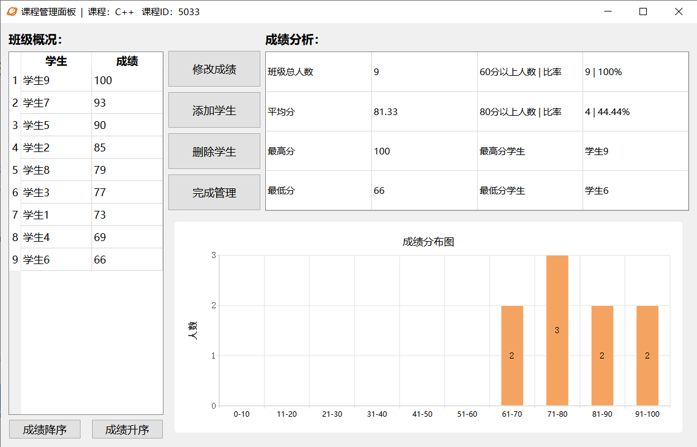
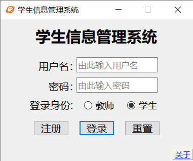
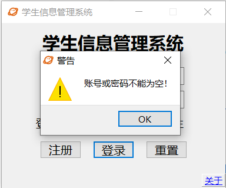
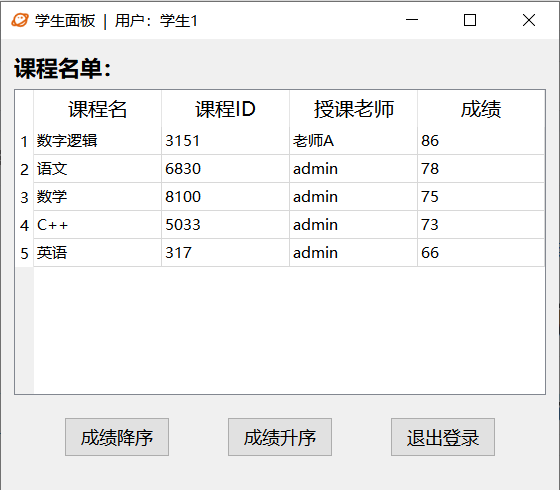
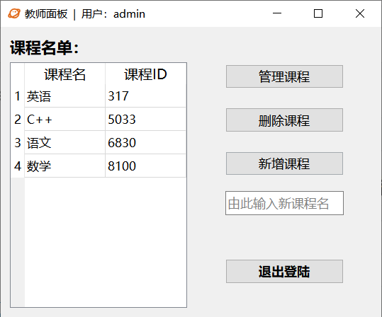
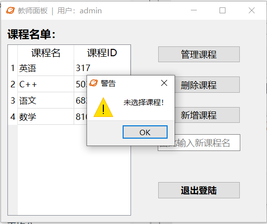
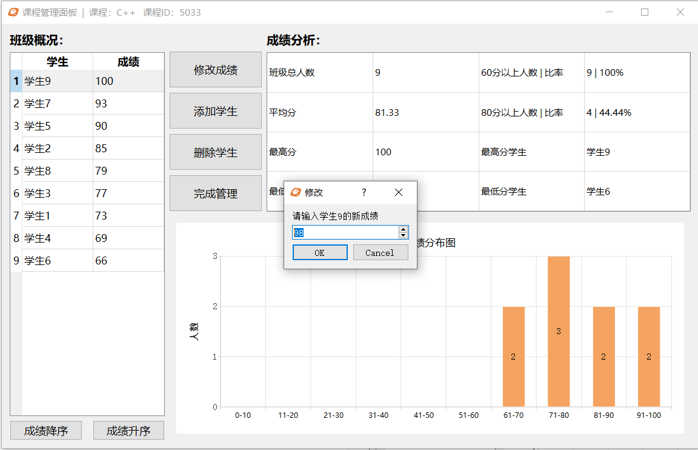
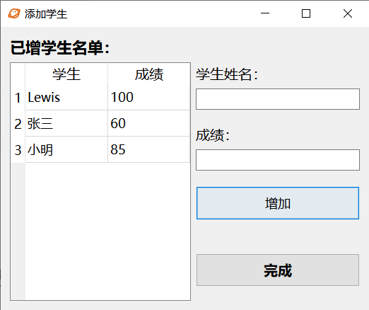
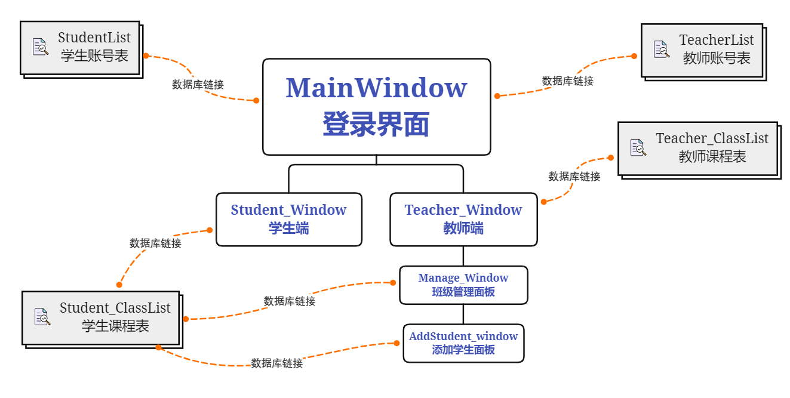

# StuInfo_Manage_System
基于Qt的学生信息管理系统。

- 教师端：支持增删查改，班级成绩分析。
- 学生端：查看成绩。
- 数据库使用SQLite。

系统界面预览：



---

以下为项目详细介绍：

# 程序功能

## 登录端





- 用户密码输入为空检测
- enter快捷键登录
- 右下角关于文档  获取帮助


## 学生端



- 所有课程成绩查询
- 成绩降序/升序排列
- 窗口自适应大小


## 教师端

### 主面板





- 窗口自适应大小
- 支持新增多班级的**同名课程**
- 双击列表默认打开课程管理面板，新增课程名为空检测，课程选择检测
- 删除课程


### 管理面板




- 班级成绩排名升序/降序排列
- 窗口自适应大小
- 班级成绩分析：及格/优秀 人数、比率；最高分、最低分 的分值、学生名单；平均分
- 成绩分布图
- 修改学生成绩，成绩区间0-100，可使用方向键快捷更改
- 删除学生


### 新增学生面板



- 窗口大小自适应
- 批量增加学生
- enter快捷键增加
- 学生姓名、成绩输入为空检测


# 测试账号

## 教师端

| 用户名 | 密码 |
| ------ | ---- |
| admin  | 555  |
| 老师A  | 123  |

## 学生端

| 用户名 | 密码 |
| ------ | ---- |
| 学生1  | 111  |
| 学生2  | 222  |
| 学生3  | 333  |
| 学生4  | 444  |
| 学生5  | 555  |
| 学生6  | 666  |
| 学生7  | 777  |
| 学生8  | 888  |
| 学生9  | 999  |


# 项目框架

## 程序界面关系




## 工程管理文件 <配置项>

### StuInfo_Manage_System.pro

**项目所用模块：**

```C++
QT += core gui sql charts
```

**项目所用头文件：**

```C++
HEADERS += \
    addstudent_window.h \
    global.h \
    mainwindow.h \
    manage_window.h \
    student_window.h \
    teacher_window.h
```

**项目所用源文件：**

```C++
SOURCES += \
    addstudent_window.cpp \
    global.cpp \
    main.cpp \
    mainwindow.cpp \
    manage_window.cpp \
    student_window.cpp \
    teacher_window.cpp
```

**项目所用ui文件：**

```C++
FORMS += \
    addstudent_window.ui \
    mainwindow.ui \
    manage_window.ui \
    student_window.ui \
    teacher_window.ui
```

**项目所用资源文件**

```C++
RESOURCES += \
    setIcon.qrc
```


# 具体结构	

## 类

### global

#### 数据成员

```c++
static QSqlDatabase db;			//实例化一个数据库连接
```

#### 函数成员

```C++
void Global::ins_db();			//用于初始化数据库的连接
static QSqlDatabase getdb();	//其他类获取数据库连接db的接口
```


### mainwindow

#### 数据成员

```C++
Teacher_Window *w1;				//储存教师窗口实例化对象
Student_Window *w2;				//储存学生窗口实例化对象
QString Username_this;			//记录输入用户名
QString Password_this;			//记录输入密码
```

#### 槽：

```c++
void Login_Button_clicked();	//响应登录按钮
void Signup_Button_clicked();	//响应注册按钮
void Reset_Button_clicked();	//响应重置按钮
void Input_Judge();			   //判断输入是否为空
```


### teacher_window

#### 数据成员：

```c++
QWidget* top;					//记录调用自己的parent对象
QString classid_selected = "";	 //记录选中的课程ID
QString class_selected = "";	 //记录选中的课程名
```

#### 函数成员：

```c++
void reload_ClassList();	//刷新课程名单
void setupClassList();		//初始化课程名单
```

#### 槽：

```c++
void getItem(int row, int column);		//获取所选表格位置
void Select_Judge();		//判断是否选择课程，并选择调用管理按钮、删除按钮以及新增按钮
void manage_button_clicked();			//响应管理按钮
void delete_button_clicked();			//响应删除按钮
void add_button_clicked();				//响应新增按钮
void exit_button_clicked();				//返回至上一界面
```


### manage_window

#### 数据成员：

```c++
QWidget* top;				//记录调用自己的parent对象
int distribution[10];		//记录班级成绩分布值
QString student_selected;	//记录选中的学生
QString classid_this;		//记录选中的课程
QString classname_this;		//记录选中的课程id
int grade;					//记录从数据库返回的成绩
int highest_score;			//记录班级最高成绩
int lowest_score;			//记录班级最低成绩
float average_score;		//记录班级平均成绩
int total;					//记录班级总人数
int pass_num;				//记录班级及格人数
int above_num;				//记录班级优秀人数
QString highest_stu = "-";	 //记录最高分学生名单
QString lowest_stu = "-";	//记录最低分学生名单
bool order_mode = true;		//记录成绩排序模式
AddStudent_window* w1;		//储存新增学生面板实例化对象
QChartView *chartView;		//储存新增图表视图实例化对象
QChart *chart;				//储存新增图标实例化对象
QValueAxis *axisY;			//储存Y轴实例化对象
```

#### 函数成员：

```c++
void setupList();			//初始化StudentList
void reload_analysis();		//重新加载分析图表
void CreateChart();			//创建成绩分布图
```

#### 信号：

**此处定义一个信号供setupList()使用**

不直接在setupList()中调用该函数，是因为reload_StudentList()中会通过sender()来获取发射信号来调用自己的对象名，以实现成绩升序、降序排列**（注意，reload_StudentList()是槽函数）**，如果直接在setupList()中调用reload_StudentList()，sender()会报错。

```c++
void init();		//用于调用reload_StudentList(); 
```

#### 槽：

```c++
void exit_button_clicked();				//返回至上一界面
void reset_button_clicked();			//响应修改成绩按钮
void reload_StudentList();				//重新加载StudentList
void reloadChart();						//重新加载成绩分布图
void getItem(int row, int column);		 //获取所选表格位置
void delete_button_clicked();			//响应删除按钮
void add_button_clicked();				//响应新增学生按钮
void Select_Judge();					//判断是否选择学生
```


### addstudent_window

#### 数据成员：

```c++
QWidget* top;				//记录调用自己的parent对象
int addlist_rows = 0;		//记录新增学生个数
```

#### 信号：

```c++
void reloadStudentList_signal();	//重新加载manage_window中StudentList的信号
void reloadChart_signal();			//重新加载manage_window中成绩分布图的信号
```

#### 槽：

```c++
void add_student();			//响应增加按钮
void backTotop();			//返回至上一界面
```


### student_window

#### 数据成员：

```c++
QWidget* top;				//记录调用自己的parent对象
```

#### 函数成员：

```c++
void setup_ClassList();		//初始化学生成绩表
```

#### 信号：

```c++
void init();	//同manage_window，用于避免sender()报错的同时调用load_ClassList()
```

#### 槽：

```c++
void load_ClassList();			//重新加载学生成绩表
void exit_button_clicked();		//返回至上一界面
```


# 具体实现

**建议直接读相关函数的具体实现代码,需注意部分已注释，此处不在赘述。**
